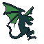

  

   

## wyvern
An useful League of Legends  helper.  
  
If you want to contribute, please check out the code style  note.

### Code style note.
1. Strings
 - Events, cases and paths starts with one tick. ('example string')
 - All others starts with two ticks. ("example string")
2. Other rules
- Even though this is JavaScript, semicolons are required.
- If statements with one line after it should be written in the same line.